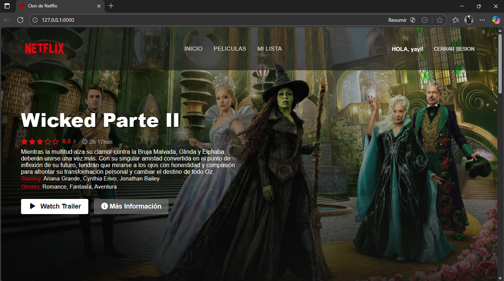
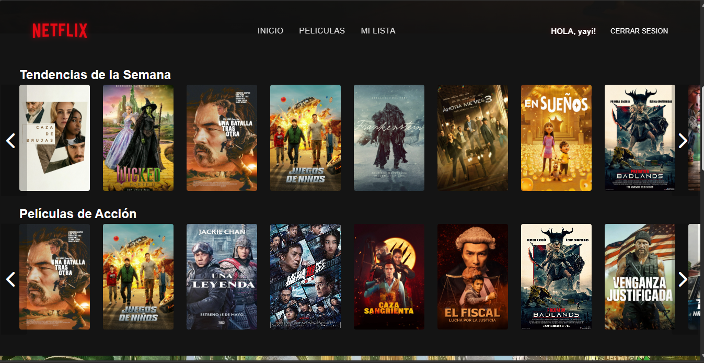
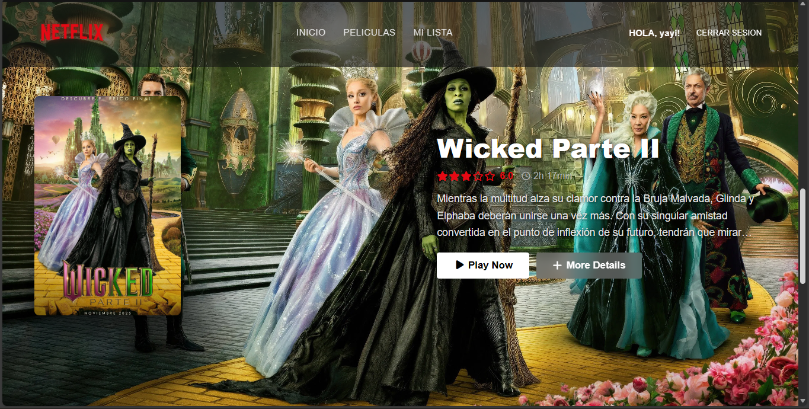
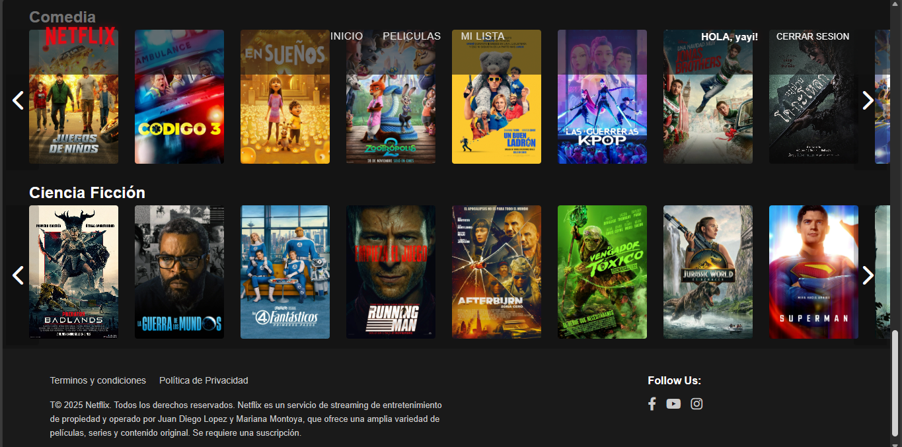
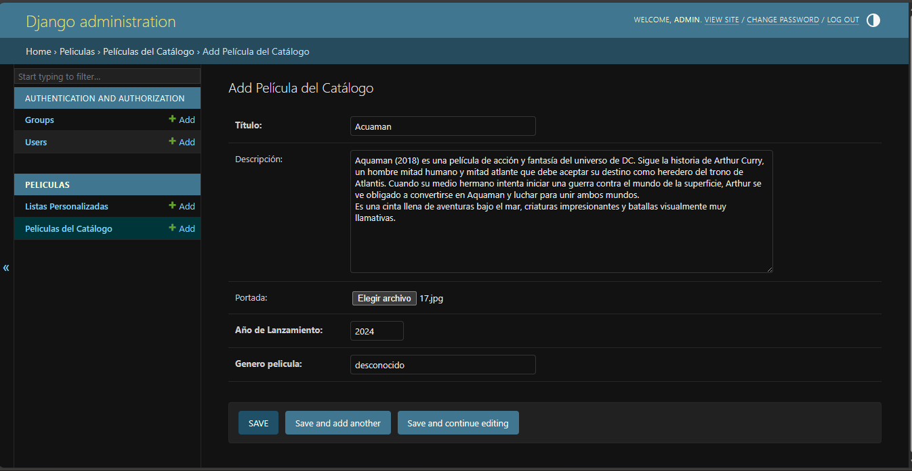
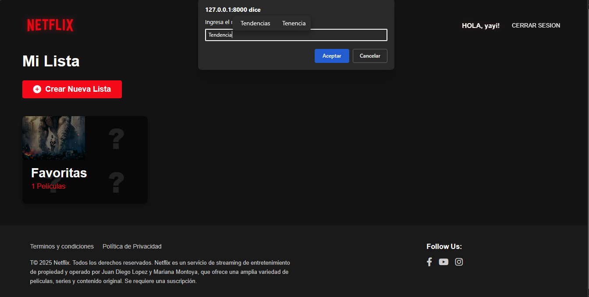

# 🎬 Netflix Clone - Django


> Clon funcional de Netflix desarrollado con Django que integra autenticación de usuarios, API externa de películas (TMDB), panel administrativo y funcionalidad de listas personalizadas "Mi Lista".

---

## 📸 Vista Previa

<table>
  <tr>
    <td></td>
    <td></td>
  </tr>
  <tr>
    <td></td>
    <td></td>
  </tr>
</table>

---

## ✨ Características Principales

- 🔐 **Sistema de autenticación completo**
  - Registro de usuarios con validación
  - Inicio de sesión y cierre de sesión
  - Gestión de perfiles de usuario

- 🎥 **Integración con API externa**
  - Consumo de películas reales desde TMDB (The Movie Database)
  - Información actualizada de películas y series
  - Trailers integrados desde YouTube

- 👨‍💼 **Panel de administración Django**
  - Añadir, editar y eliminar películas desde el admin
  - Gestión completa de contenido
  - Sistema de categorías y géneros

- ⭐ **Funcionalidad "Mi Lista"**
  - Los usuarios pueden crear listas personalizadas
  - Guardar películas favoritas
  - Gestionar su colección personal

- 🔍 **Búsqueda y filtrado avanzado**
  - Búsqueda por título
  - Filtrado por categorías y géneros
  - Navegación intuitiva

- 📱 **Diseño responsive**
  - Adaptado a dispositivos móviles
  - Interfaz optimizada para tablets
  - Experiencia fluida en desktop

---

## 🛠️ Tecnologías Utilizadas

### Backend
- **Django 4.x** - Framework web de alto nivel para Python
- **Python 3.8+** - Lenguaje de programación principal
- **MySQL** - Sistema de gestión de base de datos relacional
- **Django ORM** - Mapeo objeto-relacional para interacción con la BD

### Frontend
- **HTML5** - Estructura y contenido
- **CSS3** - Estilos y diseño visual
- **JavaScript** - Interactividad y funcionalidades dinámicas

### APIs Externas
- **TMDB API** - The Movie Database para información de películas

---

## 📋 Requisitos Previos

Antes de comenzar, asegúrate de tener instalado:

- **Python 3.8 o superior** - [Descargar aquí](https://www.python.org/downloads/)
- **pip** - Gestor de paquetes de Python (incluido con Python)
- **MySQL Server** - [Descargar aquí](https://dev.mysql.com/downloads/mysql/)
- **Git** - Para clonar el repositorio
- **Virtualenv** (recomendado) - Para crear entornos virtuales
- **Cuenta en TMDB** - [Registrarse aquí](https://www.themoviedb.org/) para obtener API Key

---

## 🚀 Instalación y Configuración

### 1️⃣ Clonar el repositorio

```bash
git clone https://github.com/Juan-Diego22/NetflixDjango.git
cd NetflixDjango
```

### 2️⃣ Crear y activar entorno virtual

**Windows:**
```bash
python -m venv venv
venv\Scripts\activate
```

**Linux/Mac:**
```bash
python3 -m venv venv
source venv/bin/activate
```

### 3️⃣ Instalar dependencias

```bash
pip install -r requirements.txt
```

> **Nota:** Si el archivo `requirements.txt` no existe, instala las dependencias básicas:
```bash
pip install django mysqlclient requests python-decouple
```

### 4️⃣ Configurar base de datos MySQL

**Crear base de datos:**

```sql
CREATE DATABASE netflix_db CHARACTER SET utf8mb4 COLLATE utf8mb4_unicode_ci;
```

**Configurar credenciales:**

Edita el archivo `Catalogo/settings.py` con tus credenciales de MySQL:

```python
DATABASES = {
    'default': {
        'ENGINE': 'django.db.backends.mysql',
        'NAME': 'netflix_db',
        'USER': 'tu_usuario_mysql',
        'PASSWORD': 'tu_contraseña_mysql',
        'HOST': 'localhost',
        'PORT': '3306',
    }
}
```

### 5️⃣ Configurar variables de entorno

Crea un archivo `.env` en la raíz del proyecto:

```env
# Django
SECRET_KEY=tu_django_secret_key_aqui
DEBUG=True

# TMDB API
TMDB_API_KEY=tu_api_key_de_tmdb_aqui

# Database
DB_NAME=netflix_db
DB_USER=tu_usuario_mysql
DB_PASSWORD=tu_contraseña_mysql
DB_HOST=localhost
DB_PORT=3306
```

> **Obtener TMDB API Key:** Ve a [TMDB Settings](https://www.themoviedb.org/settings/api) después de registrarte

### 6️⃣ Realizar migraciones de base de datos

```bash
python manage.py makemigrations
python manage.py migrate
```

### 7️⃣ Crear superusuario (administrador)

```bash
python manage.py createsuperuser
```

Ingresa:
- Username
- Email
- Password (mínimo 8 caracteres)

### 8️⃣ Cargar datos iniciales (opcional)

Si tienes fixtures con datos de ejemplo:

```bash
python manage.py loaddata initial_data.json
```

### 9️⃣ Ejecutar servidor de desarrollo

```bash
python manage.py runserver
```

✅ **¡Listo!** Accede a la aplicación en: **http://127.0.0.1:8000/**

---

## 📁 Estructura del Proyecto

```
NetflixDjango/
│
├── Catalogo/                     # Aplicación principal de Django
│   ├── migrations/               # Migraciones de base de datos
│   ├── templates/                # Plantillas HTML
│   │   ├── base.html            # Template base
│   │   ├── home.html            # Página principal
│   │   ├── movie_detail.html   # Detalle de película
│   │   └── my_list.html        # Mi lista personalizada
│   ├── static/                   # Archivos estáticos
│   │   ├── css/                 # Hojas de estilo
│   │   ├── js/                  # Scripts JavaScript
│   │   └── images/              # Imágenes del proyecto
│   ├── models.py                 # Modelos de datos (Película, Usuario, Lista)
│   ├── views.py                  # Vistas y lógica de negocio
│   ├── urls.py                   # Rutas de la aplicación
│   ├── forms.py                  # Formularios Django
│   └── admin.py                  # Configuración del panel admin
│
├── screenshorts/                 # Capturas de pantalla para README
├── manage.py                     # Script principal de Django
├── requirements.txt              # Dependencias del proyecto
├── .env                          # Variables de entorno (no incluir en Git)
├── .gitignore                    # Archivos ignorados por Git
└── README.md                     # Documentación del proyecto
```

---

## 🎯 Guía de Uso

### 👤 Para Usuarios Finales

1. **Registro e Inicio de Sesión**
   - Accede a la página principal
   - Crea una cuenta o inicia sesión con credenciales existentes

2. **Explorar Catálogo**
   - Navega por las diferentes categorías
   - Usa el buscador para encontrar películas específicas
   - Filtra por género o año

3. **Ver Detalles de Película**
   - Haz clic en cualquier película para ver información completa
   - Mira el trailer integrado
   - Lee sinopsis, calificación y detalles adicionales

4. **Gestionar "Mi Lista"**
   - Crea tu lista personal de películas favoritas
   - Añade o elimina películas con un clic
   - Accede rápidamente a tu contenido guardado

5. **Búsqueda Avanzada**
   - Utiliza la barra de búsqueda en el header
   - Filtra resultados por categoría
   - Encuentra contenido relevante fácilmente

### 👨‍💼 Para Administradores

1. **Acceder al Panel Admin**
   - Ve a: `http://127.0.0.1:8000/admin/`
   - Inicia sesión con las credenciales de superusuario

2. **Gestionar Películas**
   - Añade nuevas películas manualmente
   - Edita información existente
   - Elimina contenido no deseado

3. **Administrar Usuarios**
   - Revisa usuarios registrados
   - Gestiona permisos y grupos
   - Moderar contenido generado por usuarios

4. **Configurar Categorías**
   - Crea nuevas categorías o géneros
   - Organiza el contenido por temas
   - Optimiza la experiencia de navegación

---

## 📸 Capturas de Pantalla Detalladas

### 🎬 Funcionalidades del Sistema

#### Panel de Administración

*Interfaz para agregar películas desde el panel de administración de Django*

#### Vista de Catálogo

*Exploración del catálogo completo de películas disponibles*

#### Descripción de Película

*Vista detallada con información completa, trailer y opciones*

#### Creación de Lista Personalizada

*Interfaz para crear una nueva lista personalizada "Mi Lista"*

#### Añadir Película a Lista

*Proceso de agregar una película a la lista personalizada*

#### Lista con Contenido

*Visualización de la lista con películas añadidas*

#### Gestión de Mi Lista

*Vista completa de "Mi Lista" con todas las películas guardadas*

---

## 🔧 Configuración Avanzada

### Configurar caché (opcional)

Para mejorar el rendimiento, puedes configurar Redis como backend de caché:

```python
# settings.py
CACHES = {
    'default': {
        'BACKEND': 'django.core.cache.backends.redis.RedisCache',
        'LOCATION': 'redis://127.0.0.1:6379/1',
    }
}
```

### Configurar archivos estáticos para producción

```bash
python manage.py collectstatic
```

### Variables de entorno en producción

Asegúrate de cambiar `DEBUG=False` en producción y configurar `ALLOWED_HOSTS`:

```python
DEBUG = False
ALLOWED_HOSTS = ['tudominio.com', 'www.tudominio.com']
```

---

## 🔮 Roadmap - Mejoras Futuras

- [ ] **Sistema de recomendaciones** - Algoritmo basado en preferencias del usuario
- [ ] **Comentarios y reseñas** - Permitir que usuarios dejen opiniones
- [ ] **Calificaciones con estrellas** - Sistema de puntuación por película
- [ ] **Perfiles múltiples** - Varios perfiles por cuenta (como Netflix real)
- [ ] **Reproductor de video integrado** - Streaming de contenido real
- [ ] **Sistema de suscripciones** - Planes premium y gratuitos
- [ ] **Notificaciones push** - Alertas de nuevo contenido
- [ ] **Modo oscuro/claro** - Toggle de temas visuales
- [ ] **Subtítulos multiidioma** - Soporte para diferentes idiomas
- [ ] **Historial de visualización** - Tracking de contenido visto
- [ ] **Continue watching** - Reanudar desde donde se quedó
- [ ] **Dockerización** - Containerización para fácil deployment
- [ ] **Tests automatizados** - Unit tests y integration tests
- [ ] **CI/CD Pipeline** - Integración y despliegue continuo
- [ ] **Deploy en AWS/Heroku** - Puesta en producción

---

## 🐛 Solución de Problemas Comunes

### Error de conexión a MySQL
```
django.db.utils.OperationalError: (2003, "Can't connect to MySQL server")
```
**Solución:** Verifica que MySQL esté corriendo y las credenciales en `settings.py` sean correctas.

### Error de módulos no encontrados
```
ModuleNotFoundError: No module named 'django'
```
**Solución:** Asegúrate de tener el entorno virtual activado y haber ejecutado `pip install -r requirements.txt`

### Error con migraciones
```
django.db.migrations.exceptions.InconsistentMigrationHistory
```
**Solución:** Elimina la base de datos, créala de nuevo y ejecuta las migraciones otra vez.

### TMDB API no responde
**Solución:** Verifica que tu API key sea válida en [TMDB Settings](https://www.themoviedb.org/settings/api)

---

## 🤝 Contribuciones

Las contribuciones son bienvenidas y apreciadas. Si deseas mejorar este proyecto:

### Cómo contribuir:

1. **Fork** el repositorio
2. Crea una **rama** para tu feature (`git checkout -b feature/NuevaCaracteristica`)
3. **Commit** tus cambios (`git commit -m 'feat: Añadir nueva característica'`)
4. **Push** a la rama (`git push origin feature/NuevaCaracteristica`)
5. Abre un **Pull Request** con descripción detallada

### Guías de contribución:

- Sigue las convenciones de código de Django
- Documenta nuevas funcionalidades
- Añade tests para nuevas features
- Actualiza el README si es necesario

---

## 📄 Licencia

Este proyecto está bajo la licencia MIT. Esto significa que puedes:

- ✅ Usar el código comercialmente
- ✅ Modificar el código
- ✅ Distribuir el código
- ✅ Uso privado

Ver el archivo [LICENSE](LICENSE) para más detalles.

---

## 👨‍💻 Autor

**Juan Diego**

- 🐙 GitHub: [@Juan-Diego22](https://github.com/Juan-Diego22)
- 💼 LinkedIn: [Tu perfil de LinkedIn aquí]
- 📧 Email: tu.email@ejemplo.com
- 🌐 Portfolio: [Tu sitio web si lo tienes]

---

## 🙏 Agradecimientos

Este proyecto fue posible gracias a:

- **Netflix** - Por la inspiración del diseño e interfaz
- **TMDB** - Por proporcionar la API gratuita de películas
- **Django Community** - Por la excelente documentación y soporte
- **YouTube** - Por los tutoriales que ayudaron en el desarrollo
- **Stack Overflow** - Por resolver dudas durante el desarrollo

---

## 📚 Recursos Adicionales

### Documentación oficial:
- [Django Documentation](https://docs.djangoproject.com/)
- [TMDB API Documentation](https://developers.themoviedb.org/3)
- [MySQL Documentation](https://dev.mysql.com/doc/)

### Tutoriales recomendados:
- [Django for Beginners](https://djangoforbeginners.com/)
- [REST APIs with Django](https://www.django-rest-framework.org/)

---

## 📊 Estado del Proyecto


